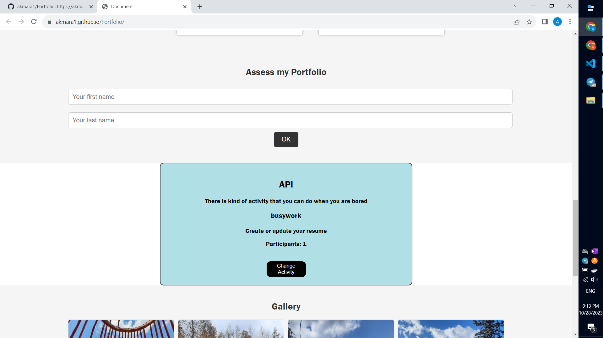

# My Portfolio

Hi there! Welcome to my portfolio. This is where I showcase my work, skills, and a bit about myself. Whether you're an employer, colleague, or just a curious visitor, I hope you find something interesting here.

## Features

- Interactive tabs for easy navigation.
- Detailed information about my skills, education, and work experience.
- Showcase of projects I've worked on.
- An API section for generating fun activities.
- A gallery with some of my favorite images.
- Embedded YouTube videos.
- Contact information for getting in touch with me.

## Technologies

- HTML/CSS
- JavaScript

## How to View

You can view my portfolio online on GitHub Pages. Just follow this link: [View My Portfolio](https://akmara1.github.io/Portfolio/)

If you want to run it locally, you can clone the repository and open the `index.html` file in your web browser.

## Screenshots

- Home Page and About Page
  
  

- My Resume
  

- My projects
  

- Api part. You can choose any activity to do when you are bored.
  

- Gallery and Contacts. I put random photographies from my phone that I have taken.
  